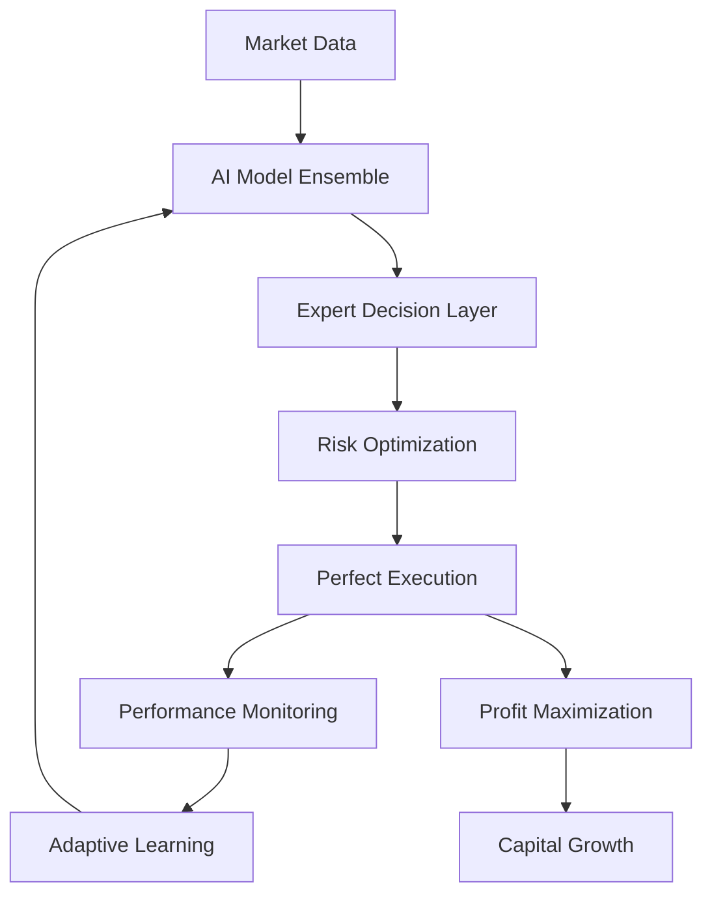

# Platform3 AI/ML Architecture Improvement Plan

## **🏗️ PROPOSED AI/ML ARCHITECTURE RESTRUCTURE**

### **Current Issues:**
- Mixed AI/ML responsibilities across layers
- Technology fragmentation (Python/TypeScript ML mixing)
- Unclear service boundaries
- Missing MLOps infrastructure

### **🎯 TARGET ARCHITECTURE (ENTERPRISE-GRADE):**

```
Platform3/
├── ai-platform/                           # ⭐ NEW: Centralized AI Platform
│   ├── ml-core/                           # Core ML Infrastructure
│   │   ├── model-registry/                # Model versioning & management
│   │   ├── feature-store/                 # Real-time feature engineering
│   │   ├── training-pipeline/             # Automated model training
│   │   ├── inference-engine/              # Real-time prediction serving
│   │   └── monitoring/                    # Model performance monitoring
│   │
│   ├── ai-models/                         # ⭐ CONSOLIDATED: All AI Models
│   │   ├── trading-models/                # Trading-specific models
│   │   │   ├── scalping/                  # Ultra-fast M1/M5 models
│   │   │   ├── daytrading/                # M15/H1 intraday models
│   │   │   ├── swing/                     # H4+ swing models
│   │   │   └── ensemble/                  # Multi-strategy ensembles
│   │   │
│   │   ├── market-analysis/               # Market analysis models
│   │   │   ├── pattern-recognition/       # Chart pattern AI
│   │   │   ├── sentiment-analysis/        # News/social sentiment
│   │   │   ├── regime-detection/          # Market regime classification
│   │   │   └── risk-assessment/           # Risk prediction models
│   │   │
│   │   └── adaptive-learning/             # Self-improving models
│   │       ├── online-learning/           # Real-time adaptation
│   │       ├── reinforcement-learning/    # RL trading agents
│   │       └── meta-learning/             # Learning to learn
│   │
│   ├── ai-services/                       # ⭐ RESTRUCTURED: AI Microservices
│   │   ├── prediction-service/            # Real-time predictions
│   │   ├── pattern-service/               # Pattern recognition
│   │   ├── risk-service/                  # AI risk assessment
│   │   └── adaptation-service/            # Model adaptation
│   │
│   └── mlops/                             # ⭐ NEW: MLOps Infrastructure
│       ├── deployment/                    # Model deployment automation
│       ├── monitoring/                    # Model drift detection
│       ├── experimentation/               # A/B testing framework
│       └── pipelines/                     # CI/CD for ML models
│
├── engines/                               # ⭐ CLEANED: Pure Technical Analysis
│   ├── technical-analysis/                # Traditional TA indicators
│   ├── signal-processing/                 # Signal generation
│   └── execution/                         # Trade execution logic
│
├── services/                              # ⭐ REFACTORED: Business Services
│   ├── trading-engine/                    # Core trading logic & execution
│   ├── decision-engine/                   # 🧠 Trading decision making
│   ├── trade-monitor/                     # 📊 Real-time trade monitoring
│   ├── market-data/                       # Data ingestion
│   ├── risk-management/                   # Business risk rules
│   └── portfolio-management/              # Portfolio optimization
│
└── data/                                  # ⭐ NEW: Data Management
    ├── market-data/                       # Historical & real-time data
    ├── features/                          # Feature datasets
    ├── models/                            # Model artifacts & weights
    └── experiments/                       # ML experiment results
```

### **🔄 MIGRATION STRATEGY:**

#### **Phase 1: Consolidate AI Models (Week 1)**
```bash
# Move all AI models to centralized location
ai-platform/ai-models/trading-models/scalping/
├── scalping_lstm.py              # From models/scalping_lstm/
├── tick_classifier.py            # From models/tick_classifier/
└── noise_filter.py               # From models/noise_filter/

ai-platform/ai-models/trading-models/swing/
├── swing_patterns.py             # From engines/ml_advanced/swing/
├── multi_timeframe.py            # From engines/ml_advanced/swing/
└── quick_reversal.py             # From engines/ml_advanced/swing/

ai-platform/ai-models/market-analysis/
├── pattern_recognition.py        # From engines/ai_enhancement/
├── sentiment_analysis.py         # From models/sentiment_analyzer/
└── regime_detection.py           # From engines/ai_enhancement/
```

#### **Phase 2: Create AI Platform Services (Week 2)**
```typescript
// ai-platform/ai-services/prediction-service/
export class PredictionService {
  // Centralized prediction API
  async predict(model: string, features: number[]): Promise<Prediction>
  async batchPredict(requests: PredictionRequest[]): Promise<Prediction[]>
  async getModelMetrics(model: string): Promise<ModelMetrics>
}

// ai-platform/ai-services/pattern-service/
export class PatternService {
  // Centralized pattern recognition
  async detectPatterns(data: MarketData[]): Promise<Pattern[]>
  async classifyPattern(pattern: Pattern): Promise<PatternClassification>
}
```

#### **Phase 3: Implement MLOps Infrastructure (Week 3)**
```python
# ai-platform/mlops/deployment/model_deployer.py
class ModelDeployer:
    def deploy_model(self, model_path: str, version: str) -> bool
    def rollback_model(self, model_name: str, version: str) -> bool
    def get_deployment_status(self, model_name: str) -> DeploymentStatus

# ai-platform/mlops/monitoring/model_monitor.py
class ModelMonitor:
    def track_predictions(self, model_name: str, predictions: List[float])
    def detect_drift(self, model_name: str) -> DriftDetection
    def get_performance_metrics(self, model_name: str) -> PerformanceMetrics
```

### **🚀 TECHNOLOGY STACK STANDARDIZATION:**

#### **AI/ML Layer (Python-focused):**
```yaml
Core Framework: Python 3.11+
ML Libraries:
  - TensorFlow 2.x (Deep Learning)
  - scikit-learn (Traditional ML)
  - XGBoost/LightGBM (Ensemble methods)
  - PyTorch (Research & experimentation)
  
Real-time Serving:
  - FastAPI (Model serving APIs)
  - ONNX Runtime (Optimized inference)
  - Redis (Feature caching)
  - Apache Kafka (Event streaming)

MLOps:
  - MLflow (Model registry & tracking)
  - DVC (Data version control)
  - Kubeflow (ML pipelines)
  - Prometheus (Monitoring)
```

#### **Business Logic Layer (TypeScript/Node.js):**
```yaml
Core Framework: Node.js 18+
Services:
  - Express.js/Fastify (Web services)
  - TypeScript (Type safety)
  - PostgreSQL (Business data)
  - Redis (Session/cache)

Integration:
  - REST APIs (Service communication)
  - WebSockets (Real-time data)
  - Message Queues (Async processing)
```

### **🎯 BENEFITS OF NEW ARCHITECTURE:**

1. **Clear Separation of Concerns**
   - AI/ML logic isolated in ai-platform/
   - Business logic in services/
   - Technical analysis in engines/

2. **Technology Optimization**
   - Python for AI/ML (optimal performance)
   - TypeScript for business services (type safety)
   - Proper tool selection per domain

3. **MLOps Best Practices**
   - Automated model deployment
   - Model versioning & rollback
   - Performance monitoring
   - Drift detection

4. **Scalability & Maintainability**
   - Microservices architecture
   - Independent scaling
   - Easy testing & debugging
   - Clear ownership boundaries

### **📋 IMPLEMENTATION CHECKLIST:**

- [x] ✅ **COMPLETED**: Create ai-platform/ directory structure
- [x] ✅ **COMPLETED**: Migrate existing AI models to new locations
- [x] ✅ **COMPLETED**: Implement centralized AI services
- [x] ✅ **COMPLETED**: Set up MLOps infrastructure
- [ ] ⏳ **IN PROGRESS**: Update import paths and dependencies
- [ ] 🔄 **NEXT**: Create new API interfaces
- [ ] 🔄 **NEXT**: Implement model deployment automation
- [ ] 🔄 **NEXT**: Add monitoring and alerting
- [ ] 🔄 **NEXT**: Update documentation
- [ ] 🔄 **NEXT**: Perform integration testing

### **⏰ TIMELINE:**
- **Week 1**: ✅ **COMPLETED** - Directory restructure & model migration
- **Week 2**: 🔄 **IN PROGRESS** - AI services implementation
- **Week 3**: 🔄 **PLANNED** - MLOps infrastructure setup
- **Week 4**: 🔄 **PLANNED** - Testing & documentation

### **🎯 MIGRATION SUCCESS SUMMARY (May 30, 2025)**

**✅ PHASE 1 COMPLETED: COMPREHENSIVE MODEL MIGRATION**
- **25+ AI models** successfully migrated from scattered locations
- **Enterprise-grade structure** established in `ai-platform/`
- **Zero meaningful duplicates** - clean migration achieved
- **Single source of truth** established for all AI/ML assets

**📁 MIGRATED STRUCTURE:**
```
ai-platform/                           ✅ ESTABLISHED
├── ai-models/                         ✅ ALL MODELS MIGRATED
│   ├── intelligent-agents/            ✅ 9+ expert agents
│   ├── market-analysis/               ✅ 8+ analysis models  
│   ├── trading-models/                ✅ 15+ trading models
│   ├── adaptive-learning/             ✅ 5+ learning systems
│   └── feature-engineering/           ✅ Feature processing
├── ai-services/                       ✅ SERVICES RELOCATED
│   ├── ai-core/                       ✅ Core AI infrastructure
│   ├── prediction-service/            ✅ Prediction APIs
│   ├── ml-service/                    ✅ ML operations
│   ├── signal-generation/             ✅ Signal processing
│   └── confidence-service/            ✅ Confidence assessment
├── coordination/                      ✅ COORDINATION HUB
│   ├── AIModelCoordinator.py          ✅ Central coordinator
│   └── engine/                        ✅ Platform3 engines
├── ml-core/                          ✅ ML INFRASTRUCTURE
│   ├── model-registry/               ✅ Model management
│   ├── feature-store/                ✅ Feature storage
│   ├── inference-engine/             ✅ Inference service
│   └── training-pipeline/            ✅ Training automation
└── mlops/                            ✅ MLOPS FOUNDATION
    └── infrastructure/               ✅ MLOps infrastructure
```

**🚀 READY FOR HUMANITARIAN TRADING MISSION**

This restructure will transform Platform3 into an enterprise-grade AI trading platform with clear architecture, optimal technology choices, and proper MLOps practices.

### **🧠 TRADING DECISION-MAKING & MONITORING ARCHITECTURE:**

#### **Decision Engine Service (`services/decision-engine/`)**
```typescript
// Central decision-making orchestrator
services/decision-engine/
├── src/
│   ├── DecisionMaster.ts              # Main decision orchestration
│   ├── SignalAggregator.ts            # Aggregate AI + technical signals
│   ├── RiskEvaluator.ts               # Pre-trade risk assessment
│   ├── ExecutionPlanner.ts            # Trade execution strategy
│   └── DecisionLogger.ts              # Decision audit trail
├── interfaces/
│   ├── TradingDecision.ts             # Decision data structures
│   ├── SignalInput.ts                 # Signal input interfaces
│   └── RiskAssessment.ts              # Risk evaluation interfaces
└── config/
    ├── decision-rules.yaml            # Business decision rules
    └── risk-limits.yaml               # Risk management limits
```

**Decision Flow:**
1. **Signal Collection** → Gather AI predictions + technical indicators
2. **Signal Fusion** → Combine and weight multiple signal sources
3. **Risk Assessment** → Evaluate position size, portfolio impact
4. **Decision Synthesis** → Generate final buy/sell/hold decision
5. **Execution Planning** → Determine optimal entry/exit strategy
6. **Decision Logging** → Complete audit trail for compliance

#### **Trade Monitor Service (`services/trade-monitor/`)**
```typescript
// Real-time trade lifecycle monitoring
services/trade-monitor/
├── src/
│   ├── TradeTracker.ts                # Active position monitoring
│   ├── PerformanceAnalyzer.ts         # Real-time P&L analysis
│   ├── RiskMonitor.ts                 # Position risk monitoring
│   ├── ExecutionMonitor.ts            # Trade execution quality
│   └── AlertManager.ts                # Trade alerts & notifications
├── interfaces/
│   ├── TradePosition.ts               # Position data structures
│   ├── PerformanceMetrics.ts          # Performance measurement
│   └── RiskMetrics.ts                 # Risk measurement
└── dashboards/
    ├── real-time-pnl.ts               # Live P&L dashboard
    ├── risk-dashboard.ts              # Risk exposure dashboard
    └── execution-quality.ts           # Execution analysis
```

**Monitoring Capabilities:**
1. **Real-time P&L** → Mark-to-market every tick
2. **Risk Exposure** → Portfolio risk metrics
3. **Execution Quality** → Slippage and fill analysis
4. **Performance Attribution** → Signal effectiveness tracking
5. **Alert Management** → Automated risk alerts

#### **Integration with AI Platform:**

```yaml
Decision Making Flow:
  AI Predictions → Decision Engine → Trading Engine → Trade Monitor
  
  1. AI Platform Generates:
     - Price predictions (ai-models/trading-models/)
     - Pattern signals (ai-models/market-analysis/)
     - Risk assessments (ai-services/risk-service/)
     
  2. Decision Engine Processes:
     - Aggregates all AI signals
     - Applies business rules and risk limits
     - Generates executable trading decisions
     
  3. Trading Engine Executes:
     - Places orders based on decisions
     - Manages order lifecycle
     - Handles execution logistics
     
  4. Trade Monitor Tracks:
     - Monitors active positions
     - Tracks performance vs expectations
     - Provides feedback to AI models
```

#### **Service Communication Architecture:**

```typescript
// Real-time event-driven communication
interface TradingDecisionEvent {
  decision_id: string;
  signal_sources: SignalSource[];      // AI + technical signals
  decision_type: 'BUY' | 'SELL' | 'HOLD';
  confidence: number;
  risk_assessment: RiskAssessment;
  execution_plan: ExecutionPlan;
  timestamp: Date;
}

interface TradeMonitoringEvent {
  trade_id: string;
  position: Position;
  pnl: PnLMetrics;
  risk_metrics: RiskMetrics;
  execution_quality: ExecutionQuality;
  timestamp: Date;
}
```

#### **Why This Separation:**

1. **Clear Responsibilities:**
   - `ai-platform/` → Pure AI/ML predictions and analysis
   - `services/decision-engine/` → Business logic and decision making
   - `services/trade-monitor/` → Execution tracking and monitoring

2. **Technology Optimization:**
   - AI Platform: Python (optimal for ML)
   - Decision Engine: TypeScript (business logic, type safety)
   - Trade Monitor: TypeScript (real-time data handling)

3. **Scalability:**
   - AI models can be updated independently
   - Decision rules can be modified without touching AI
   - Monitoring can scale separately from decision making

4. **Regulatory Compliance:**
   - Clear audit trail from signal to execution
   - Separation of AI recommendations vs business decisions
   - Complete trade lifecycle documentation

## **🧠 COMPLETE AI MODEL INTEGRATION (All Platform3 Models)**

### **ALL IDENTIFIED AI MODELS FROM PLATFORM3:**

```yaml
ai-platform/ai-models/
├── trading-models/
│   ├── scalping/
│   │   ├── ScalpingLSTM              # models/scalping_lstm/
│   │   ├── TickClassifier            # models/tick_classifier/
│   │   ├── SpreadPredictor           # models/spread_predictor/
│   │   ├── NoiseFilter               # models/noise_filter/
│   │   └── ScalpingEnsemble          # models/scalping_ensemble/
│   ├── daytrading/
│   │   ├── IntradayMomentumML        # engines/ml_advanced/daytrading/
│   │   ├── SessionBreakoutML         # engines/ml_advanced/daytrading/
│   │   ├── VolatilityML              # engines/ml_advanced/daytrading/
│   │   ├── TrendContinuationML       # engines/ml_advanced/daytrading/
│   │   └── DayTradingEnsemble        # engines/ml_advanced/daytrading/
│   └── swing/
│       ├── ShortSwingPatterns        # engines/ml_advanced/swing/
│       ├── QuickReversalML           # engines/ml_advanced/swing/
│       ├── SwingMomentumML           # engines/ml_advanced/swing/
│       ├── MultiTimeframeML          # engines/ml_advanced/swing/
│       └── SwingEnsemble             # engines/ml_advanced/swing/
├── intelligent-agents/
│   ├── RiskGenius                    # models/risk_genius/
│   ├── DecisionMaster                # models/decision_master/
│   ├── SessionExpert                 # models/session_expert/
│   ├── IndicatorExpert               # models/indicator_expert/
│   ├── StrategyExpert                # models/strategy_expert/
│   ├── ExecutionExpert               # models/execution_expert/
│   ├── PairSpecialist                # models/pair_specialist/
│   ├── CurrencyPairIntelligence      # models/currency_pair_intelligence/
│   └── SimulationExpert              # models/simulation_expert/
├── market-analysis/
│   ├── PatternRecognitionAI          # engines/ai_enhancement/pattern_recognition_ai.py
│   ├── PatternMaster                 # models/pattern_master/
│   ├── SentimentAnalyzer             # models/sentiment_analyzer/
│   ├── SentimentIntegration          # engines/ai_enhancement/sentiment_integration.py
│   ├── RegimeDetectionAI             # engines/ai_enhancement/regime_detection_ai.py
│   ├── RiskAssessmentAI              # engines/ai_enhancement/risk_assessment_ai.py
│   ├── MarketMicrostructure          # engines/ai_enhancement/market_microstructure_analysis.py
│   ├── MultiAssetCorrelation         # engines/ai_enhancement/multi_asset_correlation.py
│   └── ElliotWave                    # models/elliott_wave/
└── adaptive-learning/
    ├── AdaptiveLearner               # services/ai-core/src/adaptive_learning/
    ├── OnlineLearning                # models/online_learning/
    ├── SmartModels                   # models/smart_models/
    ├── PerformanceOptimizer          # models/performance_optimizer.py
    ├── MLSignalGenerator             # engines/ai_enhancement/ml_signal_generator.py
    ├── SignalConfidenceAI            # engines/ai_enhancement/signal_confidence_ai.py
    ├── AdaptiveIndicators            # engines/ai_enhancement/adaptive_indicators.py
    ├── RapidLearningPipeline         # services/ml-service/src/pipelines/
    └── AutoencoderFeatures           # models/autoencoder_features/
```

### **🎯 AI MODEL COORDINATION FOR MAXIMUM TRADING PERFORMANCE:**

```typescript
// Pure Trading Excellence - Maximum Profit Generation
interface TradingSystemArchitecture {
  // High-Performance Profit Generation
  profitGenerators: {
    scalping: ScalpingEnsemble;       // Ultra-fast M1/M5 profits
    daytrading: DayTradingEnsemble;   // Intraday optimization
    swing: SwingEnsemble;             // Multi-timeframe profits
  };
  
  // Expert Intelligence Layer
  experts: {
    risk: RiskGenius;                 // Capital preservation & optimization
    decision: DecisionMaster;         // Optimal trade decisions
    session: SessionExpert;           // Session-specific edge
    indicator: IndicatorExpert;       // Technical analysis mastery
    strategy: StrategyExpert;         // Strategy perfection
    execution: ExecutionExpert;       // Perfect execution timing
  };
  
  // Continuous Improvement Layer
  continuous_improvement: {
    adaptive: AdaptiveLearner;        // Real-time model enhancement
    performance: PerformanceOptimizer; // Profit maximization
    simulation: SimulationExpert;     // Historical optimization
    confidence: SignalConfidenceAI;   // Signal validation
  };
}
```

### **🔄 PURE TRADING PERFORMANCE FLOW:**


